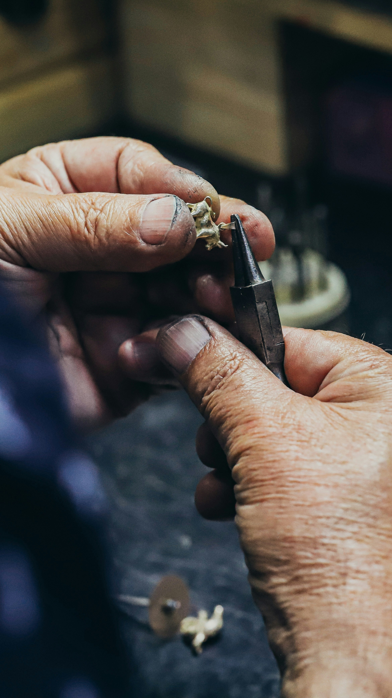

    

-------

# Projeto EBOOK Gerado por I.A.s

 > ℹ️ **NOTE:** Este é o repositório desenvolvido durante o curso no qual fui instrutor técnico na plataforma da [DIO](https://dio.me)

Projeto com o objetivo de gerar um ebook digital com as facilidades das ferramentas de IA. todos os prompts
seguem abaixo.

## 💻 Tecnologias utilizadas no projeto

- [ChatGPT](https://chat.openai.com/) 
- [MidJourney](https://www.midjourney.com/app/)
- [PowerPoint](https://www.microsoft.com/en/microsoft-365/powerpoint)

## 🧠 Prompts

ChatGPT：

|   Ação   | prompt                                                                                                                                                                                                                                                                         |
| :------: | ------------------------------------------------------------------------------------------------------------------------------------------------------------------------------------------------------------------------------------------------------------------------------ |
|  título  | crie um titulo de um ebook, curto e funcional sobre o tema como fabricar alianças. Liste algumas opções para mim                                            |
| conteúdo | elabore para mim um capitulo para o ebook, falando sobre a fundição do material |
| conteúdo | desenvolva para mim um capitulo que fale sobre o processo de laminar uma barra que foi fundida e depois iremos serrar lá no tamanho da aliança, soldar e etc.. |

Midjourney：

|  Ação  | prompt                                                                                 |
| :----: | -------------------------------------------------------------------------------------- |
| título | a goldsmith working |

## ✨ Features

- Conteúdo gerado via ChatGPT
- Imagens geradas via MidJourney

## 📚 Materiais

- Imagens utilizadas em `assets`
- ebook gerado durante as aulas em `output`

## 🛠️ Instruções de execução

Utilize os prompts acima nas ferramentas sugeridas para gerar o material base e utilize uma ferramenta de edição de documentos como power point, libreoffice , indesign para diagramação.

## 👨‍💻 Expert

    
&nbsp&nbsp&nbspVitor Benedito 
    &nbsp&nbsp&nbsp
    <a href="https://github.com/VitorBsdc">
    GitHub</a>&nbsp;|&nbsp;
    <a href="www.linkedin.com/in/
vitor-benedito">LinkedIn</a>
&nbsp;|&nbsp;
    <a href="https://www.instagram.com/vitor_bsdc">
    Instagram</a>
&nbsp;|&nbsp;

  

---

⌨️ com 💜 por [Felipe Aguiar](https://github.com/VitorBsdc)